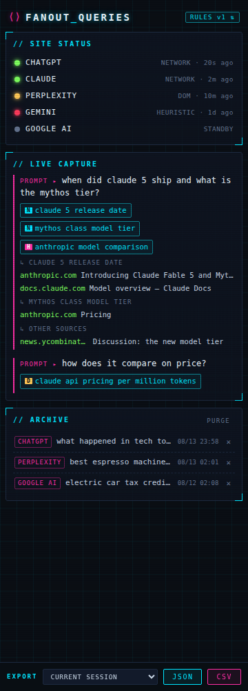

<div align="center">

# ⟨⟩ FANOUT_QUERIES

### See what the AI *actually* searched.

**A self-healing Chrome extension that exposes the hidden web searches behind every AI answer — live, in a neon side panel.**



</div>

---

Ask ChatGPT, Claude, Perplexity, Gemini, or Google AI Mode a question, and it quietly **fans out** — decomposing your prompt into a swarm of web searches you never see, pulling sources you never chose.

**Fanout Queries pulls back the curtain.** Ask your question, and watch the side panel light up with:

- 🧠 **The original prompt** — what you actually asked
- 🔍 **Every fan-out query** — the exact searches the AI ran behind the scenes
- 🔗 **Every cited source** — grouped under the query that found it

All of it streaming in live, all of it exportable.

## Why you'd want this

- **AI visibility & SEO research** — learn which queries assistants generate for your topic, and which pages they cite. This is the new search ranking.
- **Prompt engineering** — see how phrasing changes the search strategy a model picks.
- **Transparency** — know where an answer really came from before you trust it.
- **Curiosity** — it is genuinely fascinating to watch a model think in queries.

## It heals itself

AI chat sites change their internals constantly. Capture tools usually break within weeks. Fanout Queries treats that as the normal case, not the exception:

**Three capture layers per site.** Network interception, DOM scraping, then shape-based heuristics that look for *what search data looks like* rather than where it used to be. When a site renames and renests its payload, the heuristic layer keeps working — there is a test that does exactly that to prove it.

**A health monitor that tells the truth.** Status LEDs show which layer is actually holding each site up. Critically, a site running on a fallback reads **yellow**, not green — because "still capturing, but the primary path is dead" is something you want to know before it becomes "not capturing at all."

**Remote rules.** Selectors and endpoint patterns load from a versioned rules file in this repo. When a site ships a breaking change, a rules update fixes every installation — no reinstall, no release. A broken site asks for that repair on its own.

## Supported platforms

| Platform | Capture |
|---|---|
| **ChatGPT** (chatgpt.com) | Queries + sources with per-query attribution |
| **Claude** (claude.ai) | Queries + sources |
| **Perplexity** | Sub-queries + sources |
| **Gemini** (gemini.google.com) | Sources, best-effort queries |
| **Google AI Mode / AI Overviews** | DOM-first capture |

Gemini and Google AI Mode send positional array payloads with no field names at all, so they lean on DOM and heuristic capture. Everything else is read straight from the wire.

## Quick start

1. **Clone** this repo (or download the ZIP and unzip it):
   ```bash
   git clone https://github.com/mdowis/fanout-queries.git
   ```
2. Open **`chrome://extensions`** and turn on **Developer mode** (top right).
3. Click **Load unpacked** and select the folder.
4. Click the Fanout Queries toolbar icon to open the side panel.
5. Ask any AI assistant something that needs the web — *"what happened in tech news today?"* — and watch the fan-out.

Requires Chrome 116+. No build step, no dependencies, no bundler.

## Your data stays yours

Everything is captured and stored **locally** (`chrome.storage.local`). Nothing is transmitted anywhere — the only request the extension itself makes is fetching its own rules file from GitHub. Export any time as **JSON** or **CSV**.

The interceptor is built so it can never disturb the pages it watches: it reads only from a cloned copy of each response, returns the site's own promise untouched, and swallows its own failures. There is a test suite dedicated to that guarantee, because a broken chat site would be a far worse outcome than a missed capture.

> Built for personal research and development use, loaded unpacked. Respect the terms of service of the sites you use it with.

## Documentation

| Doc | What's inside |
|---|---|
| [docs/ARCHITECTURE.md](docs/ARCHITECTURE.md) | How capture works: the pipeline, the three layers, the self-healing state machine |
| [docs/RULES.md](docs/RULES.md) | The rules schema, the path syntax, and how to ship a fix when a site changes |
| [docs/TESTING.md](docs/TESTING.md) | Running the offline suite, the manual matrix, and how to force a failure to watch it heal |

```bash
npm test   # 148 tests, no dependencies
```

---

<div align="center">
<sub>⟨⟩ FANOUT_QUERIES — the searches behind the answers.</sub>
</div>
